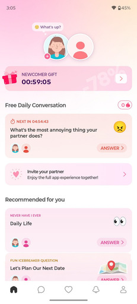

# Relationship Connection Helper App - Connectify
## Detaljan opis
Aplikacija Connectify osmišljena je kao digitalni alat koji pomaže parovima u održavanju i produbljivanju njihove veze kroz svakodnevnu komunikaciju i dijeljenje zajedničkih iskustava. U modernom načinu života, mnogi ljudi imaju sve manje vremena za kvalitetan razgovor sa svojim partnerom. Zbog posla, obaveza, udaljenosti ili jednostavno rutine, komunikacija u vezi često postaje površna i ograničena na svakodnevne obaveze. Connectify pokušava riješiti upravo taj problem – potaknuti partnere na redovitu i smisleniju komunikaciju.

Glavna funkcija aplikacije su svakodnevne teme za razgovor koje se automatski pojavljuju unutar aplikacije. Te teme su osmišljene tako da potiču partnere na razgovor o različitim aspektima njihove veze, osjećajima, planovima ili zajedničkim uspomenama. Na taj način korisnici nikada neće ostati bez ideje o čemu razgovarati, a istovremeno mogu saznati nove stvari jedno o drugome.

Korisnici aplikacije su prvenstveno parovi koji žele poboljšati komunikaciju u svojoj vezi. Posebno je korisna za osobe koje su u vezama na daljinu, jer im omogućuje da ostanu povezani i kada nisu fizički zajedno. Također može biti korisna za parove koji su dugo u vezi i osjećaju da njihova komunikacija postaje monotonija ili da gube početni entuzijazam i povezanost.

Jedna od važnih funkcija aplikacije je kalendar aktivnosti, gdje korisnici mogu vidjeti koliko su često komunicirali unutar aplikacije tijekom određenog razdoblja. Ova funkcija motivira partnere da redovito sudjeluju u razgovorima i održavaju kontinuitet komunikacije.

Osim svakodnevnih tema za razgovor, aplikacija omogućuje korisnicima da dijele svoje trenutno raspoloženje putem posebnog statusa. Kada korisnik promijeni svoj status, njegov partner dobiva obavijest koja mu može pomoći da bolje razumije kako se druga osoba trenutno osjeća. Na taj način aplikacija potiče veću emocionalnu svijest i empatiju između partnera.

Connectify također uključuje opći chat sustav koji omogućuje partnerima slobodnu komunikaciju u bilo kojem trenutku. Uz to, postoji i funkcija digitalnog dnevnika (journal) u kojem korisnici mogu zabilježiti važna zajednička iskustva ili događaje. U dnevnik je moguće dodati tekstualne opise i slike, čime se stvara digitalna zbirka uspomena koju par može kasnije pregledavati.

Aplikacija sadrži i sustav notifikacija koji prati aktivnosti unutar aplikacije, kao što su nove poruke, promjena statusa ili dodavanje zapisa u dnevnik. Na taj način korisnici uvijek ostaju informirani o aktivnostima svog partnera.

Unutar profilnog dijela aplikacije, korisnici mogu postaviti profilnu fotografiju, napisati kratki opis o sebi, označiti mjesto stanovanja te prilagoditi vizualni izgled aplikacije prema vlastitim preferencijama.

Tematika aplikacije odabrana je zato što su digitalni alati za komunikaciju danas vrlo važan dio svakodnevnog života, ali većina njih fokusira se samo na razmjenu poruka. Connectify ide korak dalje i pokušava aktivno potaknuti kvalitetniju komunikaciju između partnera, što može pozitivno utjecati na stabilnost i zadovoljstvo u vezi.

## Tablica funkcionalnosti

| Funkcionalnost | Opis |
| ------------------------------------- | -
| **OSNOVNE MOGUĆNOSTI** |
| Sustav prijave / povezivanja partnera | Dva korisnika se povezuju pomoću zajedničkog koda       |
| Svakodnevne teme za razgovor          | Aplikacija generira ili prikazuje dnevno pitanje za par |
| Chat sustav                           | Slanje i primanje poruka između partnera                |
| Pregled prošlih razgovora             | Korisnici mogu pregledati sve prethodne teme i odgovore |
| Status raspoloženja                   | Korisnik može označiti kako se trenutno osjeća          |
| Kalendar aktivnosti                   | Prikaz redovitosti komunikacije tijekom mjeseca         |
| **NAPREDNE MOGUĆNOSTI**               |                                                         |
| Digitalni dnevnik (Journal)           | Zapisivanje važnih događaja i uspomena uz slike         |
| Sustav notifikacija                   | Obavijesti o novim porukama, statusima i aktivnostima   |
| Personalizacija profila               | Profilna slika, opis korisnika i lokacija               |
| Promjena izgleda aplikacije           | Mogućnost prilagodbe teme ili dizajna                   |
| Povijest aktivnosti                   | Pregled svih radnji unutar aplikacije                   |

## Scenarij korištenja

1. Korisnik prvi put otvara aplikaciju Connectify.
2. Prilikom registracije stvara korisnički profil i dobiva jedinstveni kod.
3. Taj kod dijeli sa svojim partnerom.
4. Partner unosi kod u aplikaciju i time se povezuje s prvim korisnikom.
5. Nakon povezivanja oba korisnika dobivaju pristup zajedničkom prostoru unutar aplikacije.
6. Svaki dan aplikacija prikazuje novu temu za razgovor koju oba partnera mogu vidjeti.
7. Korisnici odgovaraju na pitanje i započinju razgovor unutar chata.
8. Tijekom dana mogu promijeniti status raspoloženja kako bi partner znao kako se osjećaju.
9. Ako se dogodi važan događaj, korisnici ga mogu zabilježiti u journal zajedno sa slikama.
10. Sve aktivnosti se prikazuju u notifikacijama, a redovitost korištenja prati se u kalendaru aktivnosti.

## Vizualni prototip

